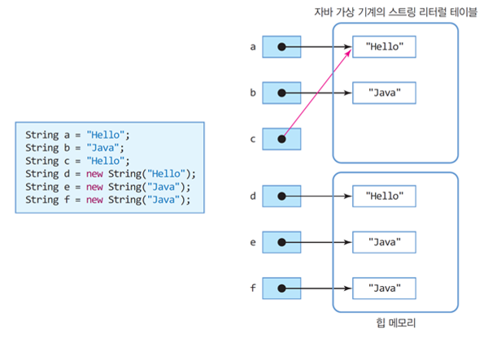

**문자열 String, StringBuffer, StringBuilder**

## String

### 생성 방법

```java
String str1 = "abcd";               //1
String str2 = new String("abcd");   //2
```

-   2번의 경우 String 객체가 새로운 heap 메모리에 생성된다.
    -   메모리 효율성이 떨어진다.



### 특징

-   **immutable(불변성)** : 한번 생성된 String 객체는 변하지 않는다.

### 주요 메소드

```java
String str = "abcde";

str.length() // str의 길이 반환
str.isEmpty() // str의 길이가 0이면 true, 아니면 false

str.charAt(2) // 인덱스로 문자 찾기, c 반환
str.indexOf("c") // 문자로 첫번째 인덱스 찾기, 2 반환
str.lastIndexOf("c") // 문자의 마지막 인덱스 찾기, 2 반환

str.substring(2, 4) // 2~3 위치의 문자열 "cd" 반환
str.substring(3) // 3부터 끝까지의 문자열 "de" 반환
str.concat("fgh") // str과 fgh를 합친 문자열 반환 (abcdefgh)

str.replace('b', 'k') // b를 k로 변경 (akcde)

str.equals("abcde") // str과 abcde를 비교해서 같으면 true, 다르면 false
str.contains("bc") // str에 bc가 포함되어 있으면 true, 아니면 false

str.split(" ") // 띄어쓰기로 구분된 문자열 str을 분리해서 String[] 배열 반환
str.split() // 띄어쓰기 없는 문자열 str을 한 문자씩 분리해서 String[] 배열 반환

str.trim() // str의 앞뒤 공백 제거, 문자열 사이 공백은 제거 X

str.toLowerCase() // 대문자를 모두 소문자로 변경
str.toUpperCase() // 소문자를 모두 대문자로 변경

str.compareTo("abcdd")
/*
str과 abcdd가 같으면 0
str이 abcdd보다 사전순으로 앞이면 -1
str이 abcdd보다 사전순으로 뒤면 1
str과 abcdd가 마지막 문자만 다르면 마지막 문자의 사전순 차이 반환 (여기선 1)
*/

Integer.parseInt(str) // 문자열을 숫자로 변환
Integer.toString(300) // 숫자를 문자열로 변환
```

### String <-> char[]

```java
String str = "abcde";
char[] arr = str.toCharArray(); // String을 char[]로 변환
String str2 = new String(arr); // char[]를 String으로 변환
```

<br/>

## StringBuffer

### 특징

-   **mutable(가변성)** : 한번 생성된 StringBuffer 객체는 변할 수 있다.
-   간단한 문자열은 String 객체, 길거나 수시로 변하는 문자열은 StringBuffer 객체 사용

### 주요 메소드

```java
StringBuffer sb = new StringBuffer("abcde");

sb.append("fgh"); // 문자열 뒤에 fgh 추가 (abcdefgh)
sb.insert(2, "k"); // 2번째 인덱스에 k 추가 (abkcde)

sb.delete(2, 4); // 2~3번째 인덱스 삭제 (abde)
sb.delete("d") // 문자 d 삭제 (abe)
sb.deleteCharAt(2); // 2번째 인덱스 삭제 (abde)

sb.replace(2, 4, "k"); // 2~3번째 인덱스를 k로 변경 (abke)

sb.reverse(); // 문자열 뒤집기 (ekba)

sb.setCharAt(2, 'k'); // 2번째 인덱스를 k로 변경 (ekka)
sb.setLength(3); // 문자열 길이를 3으로 변경 (ekk)

sb.length(); // 문자열 길이 반환 (3)
sb.charAt(2); // 2번째 인덱스의 문자 반환 (k)
sb.indexOf("k"); // 문자 k의 인덱스 반환 (2)
sb.substring(1, 3); // 1~2번째 인덱스의 문자열 반환 (kk)
sb.toString(); // 문자열 반환 (ekk)
```

<br/>

## StringBuilder

### 특징

-   StringBuffer와 동일한 기능을 가지고 있지만, **동기화를 보장하지 않는다.**
-   멀티스레드 환경이라면 값 동기화 보장을 위해 `StringBuffer`를 사용하고, 단일스레드 환경이라면 `StringBuilder`를 사용
-   문자열 연산 등으로 기존 객체의 공간이 부족하게 되는 경우, 기존의 버퍼 크기를 늘리며 유연하게 동작한다.

### 주요 메소드

-   `StringBuffer`와 동일
