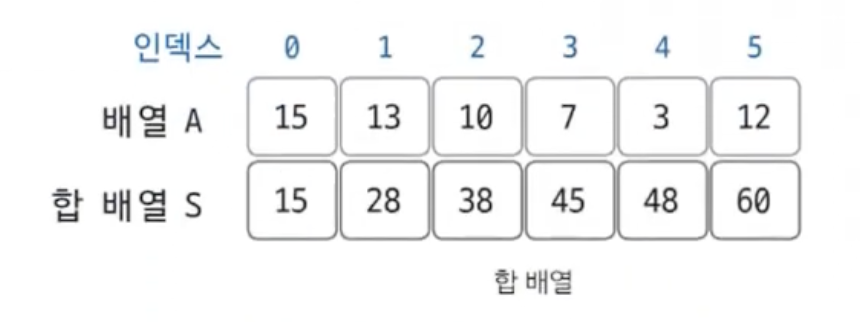

**구간합**

## 합 배열



```
S[i] = S[i-1] + A[i]
```

### 예제

백준 11659번 구간 합 구하기 4

> 수 N개가 주어졌을 때, i번째 수부터 j번째 수까지 합을 구하는 프로그램을 작성하시오.
>
> **입력**  
> 첫째 줄에 수의 개수 N과 합을 구해야 하는 횟수 M이 주어진다. 둘째 줄에는 N개의 수가 주어진다. 수는 1,000보다 작거나 같은 자연수이다. 셋째 줄부터 M개의 줄에는 합을 구해야 하는 구간 i와 j가 주어진다.
>
> **출력**  
> 총 M개의 줄에 입력으로 주어진 i번째 수부터 j번째 수까지 합을 출력한다.
>
> **제한**  
> 1 ≤ N ≤ 100,000
> 1 ≤ M ≤ 100,000
> 1 ≤ i ≤ j ≤ N

```java
package solving.BOJ;

import java.io.*;
import java.util.*;

public class B11659_구간합 {
    public static void main(String[] args) throws IOException {
        // 입력값이 많을 경우에는 Scanner보다 BufferReader 사용
        BufferedReader br = new BufferedReader(new InputStreamReader(System.in));
        // 입력값이 길 경우 int로 하나하나 받기 어려움 -> StringTokenizer 사용
        StringTokenizer st = new StringTokenizer(br.readLine());

        int N = Integer.parseInt(st.nextToken()); // 수의 개수
        int M = Integer.parseInt(st.nextToken()); // 합을 구해야 하는 횟수

        long[] S = new long[N + 1]; // 합배열
        /* long으로 선언한 이유
         * int로 선언하고 연산을 하면 범위를 넘어가는 경우가 발생할 수 있음
         */

        st = new StringTokenizer(br.readLine());
        for (int i = 1; i < N; i++) {
            S[i] = S[i - 1] + Integer.parseInt(st.nextToken());
        }

        for (int x = 0; x < M; x++) {
            st = new StringTokenizer(br.readLine());
            int i = Integer.parseInt(st.nextToken());
            int j = Integer.parseInt(st.nextToken());

            System.out.println(S[j] - S[i - 1]);
        }
    }
}

```
