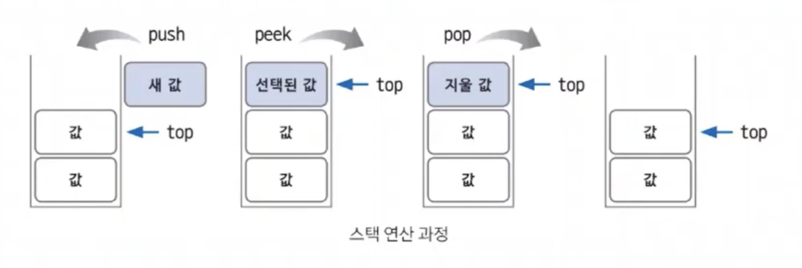
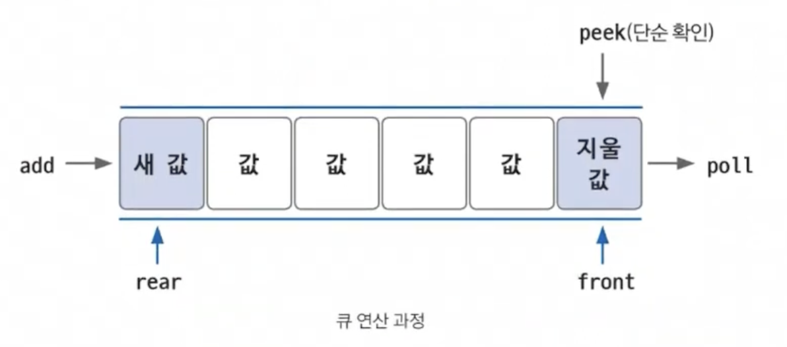

**스택과 큐**

## 스택

-   LIFO(Last In First Out) 구조
-   `top`: 삽입과 삭제가 일어나는 위치
-   push, pop, peek 연산
    -   `push`: 스택에 데이터를 삽입
    -   `pop`: 스택의 최상단 데이터를 삭제하고 확인
    -   `peek`: top 위치에 있는 데이터를 단순 확인
-   재귀 함수 알고리즘의 원리와 일맥상통
-   DFS(깊이 우선 탐색) 알고리즘

 

## 큐

-   FIFO(First In First Out) 구조
-   `rear`: 큐에서 가장 끝 데이터를 가리키는 포인터
-   front, add, poll, peek 연산
    -   `front`: 큐의 가장 앞 데이터를 확인
    -   `add`: rear 부분에 데이터를 삽입
    -   `poll`: front 부분에 있는 데이터를 삭제하고 확인
    -   `peek`: front 부분에 있는 데이터를 단순 확인
-   BFS(너비 우선 탐색) 알고리즘
