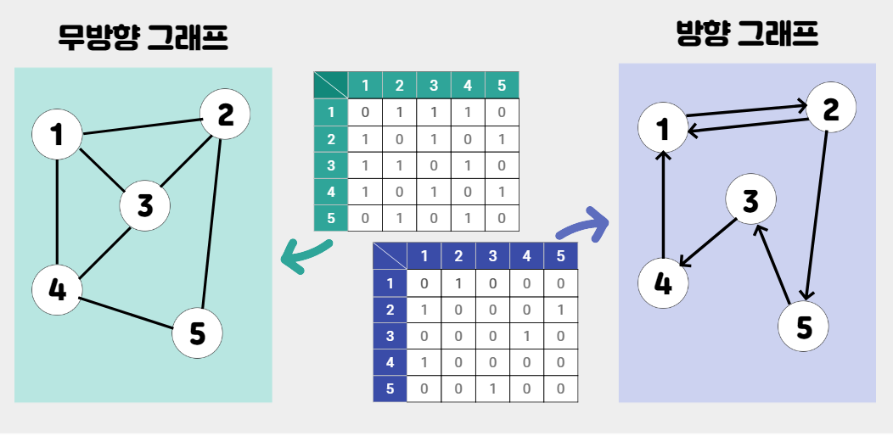
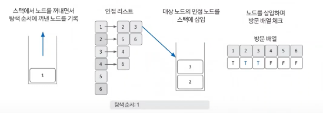

## 깊이 우선 탐색(DFS)

-   그래프 완전 탐색 기법 중 하나
-   그래프의 시작 노드에서 출발하여, 탐색할 한 쪽 분기를 선택해 최대 깊이까지 탐색한 후 다른 분기로 탐색하는 방법
-   `스택`, `재귀함수`로 구현한다.
    -   먼저 들어온 데이터가 나중에 나가는 FILO 구조
-   시간 복잡도: `O(V+E)`
    -   V: 노드의 개수
    -   E: 간선의 개수

### 주의사항

**스택 오버플로우**

-   재귀함수로 구현 시, 재귀 깊이가 너무 깊어질 경우 스택 오버플로우 발생

### 동작 원리

> **핵심 이론**
>
> 1. 한 번 방문한 노드는 다시 방문하지 않는다.  
>    -> 방문 여부를 체크할 배열이 필요
> 2. 그래프는 인접 리스트로 표현한다.
>     - 인접행렬 
>     - 인접리스트 

<br/>

**1. DFS를 시작할 노드를 정한 후 사용할 자료구조 초기화하기**

-   인접리스트 생성
-   방문 여부를 체크할 배열 생성
-   스택 생성


**2. 스택에서 노드를 꺼낸 후, 꺼낸 노드의 인접 노드를 다시 스택에 삽입하기**

-   `pop()`으로 스택에서 노드 꺼내기
-   꺼낸 노드를 탐색 순서에 기입
-   해당 노드의 인접 노드를 모두 스택에 삽입
-   노드를 삽입하며 방문 배열에 체크



**3. 스택이 빌 때까지 반복하기**

-   스택이 빌 때까지 2번 과정 반복
-   ⭐️ 스택에 노드를 삽입할 때 방문 배열을 체크하고, 스택에서 노드를 뺄 때 탐색 순서에 기록하며, 인접 노드를 방문 배열과 대조하여 삽입할지 결정한다.


<br/>

### 구현

```java
import java.util.ArrayList;
import java.util.Stack;

public class DFS {
    public static void main(String[] args) {
        int n = 7;
        int[][] graph = {
            {0, 1, 1, 0, 0, 0, 0},
            {1, 0, 0, 1, 1, 0, 0},
            {1, 0, 0, 0, 0, 1, 1},
            {0, 1, 0, 0, 0, 0, 0},
            {0, 1, 0, 0, 0, 0, 0},
            {0, 0, 1, 0, 0, 0, 0},
            {0, 0, 1, 0, 0, 0, 0}
        };

        dfs(graph, n, 0);
    }

    public static void dfs(int[][] graph, int n, int start) {
        boolean[] visited = new boolean[n];
        Stack<Integer> stack = new Stack<>();
        ArrayList<Integer> result = new ArrayList<>();

        stack.push(start);
        visited[start] = true;

        while (!stack.isEmpty()) {
            int node = stack.pop();
            result.add(node);

            for (int i = 0; i < n; i++) {
                if (graph[node][i] == 1 && !visited[i]) {
                    stack.push(i);
                    visited[i] = true;
                }
            }
        }

        for (int node : result) {
            System.out.print(node + " ");
        }
    }
}
```

<br/>
