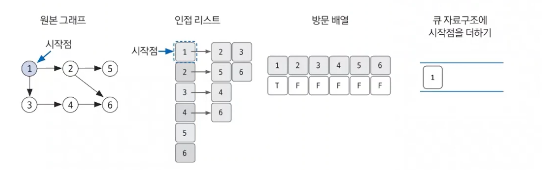
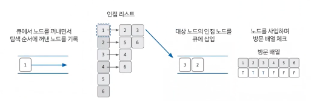
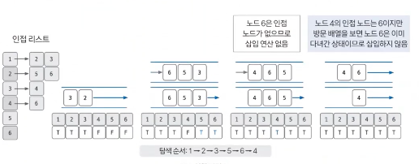

## 너비 우선 탐색(BFS)

-   그래프를 완전 탐색하는 방법 중 하나
-   시작 노드에서 출발해 시작 노드를 기준으로 가까운 노드를 먼저 방문하면서 탐색하는 알고리즘
-   `큐`로 구현한다.
    -   FIFO 구조
-   시간 복잡도: O(V+E)

### 동작 원리

> **핵심 이론**
>
> 1. 한 번 방문한 노드는 다시 방문하지 않는다.
>    -> 방문 여부를 체크할 배열이 필요
> 2. 그래프는 인접 리스트로 표현한다.
>     - 인접행렬 
>     - 인접리스트 

 

**1. BFS를 시작할 노드를 정한 후 사용할 자료구조 초기화하기**

-   인접 리스트 생성
-   방문 여부를 체크할 배열 생성
-   큐 생성

**2. 큐에서 노드를 꺼낸 후, 꺼낸 노드의 인접 노드를 다시 큐에 삽입하기**

-   `poll()`로 큐에서 노드 꺼내기
-   꺼낸 노드를 탐색 순서에 기입
-   해당 노드의 인접 노드를 모두 큐에 삽입 (방문했던 노드 제외)
-   노드를 삽입하며 방문 배열에 체크

**3. 큐가 빌 때까지 반복하기**

-   큐가 빌 때까지 2번 과정 반복
-   ⭐️ 큐에 노드를 삽입할 때 방문 배열을 체크하고, 큐에서 노드를 뺄 때 탐색 순서에 기록하며, 인접 노드를 방문 배열과 대조하여 삽입할지 결정한다.

